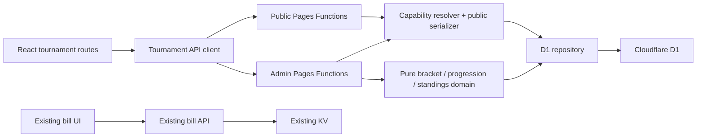

# Tournament Tool MVP — Technical Specification

**Status:** Proposed  
**Date:** 2026-08-06  
**Related documents:** [PRD](./tournament-tool-prd.md) · [Implementation plan](./tournament-tool-implementation-plan.md)

## 1. Decision summary

Implement the tournament capability as an isolated vertical feature inside the existing React/Vite application and Cloudflare Pages Functions deployment. Use a versioned JSON aggregate row in Cloudflare D1 for each tournament, retain KV only for the existing bill feature, implement bracket and standings algorithms as pure TypeScript domain functions, and protect writes with a hashed admin capability plus single-statement optimistic versioning.

This approach preserves the current deployment model while avoiding coupling to bill-specific types and KV behavior. Cloudflare documents direct D1 bindings for Pages Functions and local persistence through Wrangler, and D1 prepared statements support bound parameters and `RETURNING` results needed by the single-row compare-and-swap.

Official references:

- [Pages Functions D1 bindings](https://developers.cloudflare.com/pages/functions/bindings/#d1-databases)
- [D1 prepared statements](https://developers.cloudflare.com/d1/worker-api/prepared-statements/)
- [D1 database binding API](https://developers.cloudflare.com/d1/worker-api/d1-database/)
- [D1 read-replication consistency](https://developers.cloudflare.com/d1/best-practices/read-replication/)

## 2. Current-state constraints

- SPA routes are declared directly in `src/App.tsx:42-50`; no route-level feature boundary exists yet.
- The header has two hard-coded nav links in `src/components/Layout.tsx:32-61`.
- Theme state belongs to `App` and is passed into `Layout` in `src/App.tsx:16-50`.
- Language typing derives Vietnamese from the English object shape in `src/contexts/LanguageContext.tsx:5-17`, so new dictionaries must remain structurally identical.
- Shared styling is global and Tailwind-based in `src/index.css:1-195` and `tailwind.config.js:1-17`.
- Bill persistence is a KV list plus JSON documents in `functions/api/bills/index.ts:1-84`; this is eventually consistent, bill-shaped, and unsuitable as the tournament aggregate write model.
- The only frontend API wrapper is bill-specific in `src/lib/api.ts:1-39`.
- There is no existing test runner or test script in `package.json:1-44`.
- Development URL notifications currently post the complete `window.location.href` to a parent frame in `vite.config.ts:44-63`; this must redact capability path segments before tournament routes are safe even in development.

## 3. Architecture

### 3.1 Component view



Tournament code may depend on shared UI, theme, language, and generic utilities. Bill and tournament domains may not import one another.

### 3.2 Proposed source boundary

```text
src/
  features/tournaments/
    api/
      client.ts
      contracts.ts
    components/
      BracketBoard.tsx
      MatchCard.tsx
      StandingsTable.tsx
      EntrantEditor.tsx
      ShareLinks.tsx
    pages/
      TournamentLanding.tsx
      TournamentAdmin.tsx
      TournamentPublic.tsx
    tournamentTranslations.ts
    routes.tsx
functions/
  api/tournaments/
    index.ts
    manage/[token]/index.ts
    manage/[token]/generate.ts
    manage/[token]/matches/[matchId].ts
    view/[token].ts
  _shared/tournaments/
    access.ts
    contracts.ts
    repository.ts
    responses.ts
    service.ts
migrations/
  0001_tournaments.sql
shared/
  tournaments/
    types.ts
    contracts.ts
    generateSingleElimination.ts
    generateDoubleElimination.ts
    generateRoundRobin.ts
    progressMatches.ts
    standings.ts
    invalidation.ts
    validation.ts
public/
  _headers
  _redirects
wrangler.jsonc
tests/
  tournament-domain/
  tournament-api/
  tournament-e2e/
```

Framework-free types, contracts, validation, bracket algorithms, standings, and invalidation live in `shared/tournaments/` from phase 1. Both TypeScript configurations include this tree. Frontend-only presentation remains under `src/features/tournaments/`; server-only access, repository, and service code remains under `functions/_shared/tournaments/`. Do not duplicate algorithms.

### 3.3 Future extraction boundary

Standalone extraction must require only:

1. Moving `src/features/tournaments` and shared presentation primitives into a new Vite entry.
2. Moving tournament Pages Functions, shared server code, migrations, and D1 binding configuration.
3. Providing an implementation of a small `AppShell` interface for theme/language/header.

No tournament module may import from `src/components/pages/Calculator.tsx`, `History.tsx`, `BillDetails.tsx`, `src/types.ts`, or `src/lib/api.ts`.

## 4. Technology decisions

### 4.1 Persistence: Cloudflare D1

Use D1 rather than extending the existing KV namespace.

Reasons:

- Atomic aggregate replacement is required for progression and invalidation.
- Indexed capability lookup is required without a public list endpoint.
- Optimistic concurrency needs a single conditional version update that cannot partially apply.
- The 32-entrant bound keeps validated JSON aggregates small and makes standings derivation inexpensive.
- It remains native to Pages Functions and supports local Wrangler development.

Do not enable read replication for MVP. Manual refresh requires predictable primary reads more than global read throughput. If replication is enabled later, use D1 Sessions with `first-primary` for admin reads or propagate bookmarks so a client reads its own writes.

### 4.2 Bracket implementation

Implement algorithms locally as pure TypeScript. Do not add a bracket-generation runtime dependency in MVP. The supported formats and 32-entrant bound are small enough to specify exhaustively, and custom logic is required for selective invalidation and the nonstandard single-final double-elimination rule.

### 4.3 Testing tools

Add development-only tooling during implementation:

- Vitest for domain and service tests.
- React Testing Library plus user-event for component interaction.
- Playwright for browser journeys.
- Wrangler local D1 for API integration tests; use isolated local database state per suite.

No new production runtime dependency is required for the bracket engine.

## 5. Domain model

### 5.1 Core types

```ts
type TournamentFormat = 'single_elimination' | 'double_elimination' | 'round_robin';
type EntrantType = 'individual' | 'team';
type TournamentStatus = 'draft' | 'active' | 'completed';
type MatchState = 'blocked' | 'ready' | 'draft' | 'completed' | 'bye';
type BracketSide = 'winners' | 'losers' | 'grand_final' | 'round_robin';

interface Tournament {
  id: string;
  name: string;
  format: TournamentFormat;
  entrantType: EntrantType;
  status: TournamentStatus;
  defaultBestOf: number;
  version: number;
  createdAt: string;
  updatedAt: string;
}

interface Entrant {
  id: string;
  tournamentId: string;
  seed: number;
  name: string;
  roster: string[];
}

interface Match {
  id: string;
  tournamentId: string;
  side: BracketSide;
  round: number;
  position: number;
  sourceA: MatchSource;
  sourceB: MatchSource;
  entrantAId: string | null;
  entrantBId: string | null;
  bestOf: number;
  scoreA: number | null;
  scoreB: number | null;
  winnerId: string | null;
  state: MatchState;
  privateNote: string | null;
}
```

`MatchSource` is either a seed slot or a reference to the winner/loser of another match. The source graph—not mutable UI ordering—is authoritative for progression.

### 5.2 Database schema and aggregate persistence

```sql
CREATE TABLE tournaments (
  id TEXT PRIMARY KEY,
  public_id TEXT NOT NULL UNIQUE,
  admin_token_hash TEXT NOT NULL UNIQUE,
  state_json TEXT NOT NULL CHECK(json_valid(state_json)),
  version INTEGER NOT NULL DEFAULT 1,
  created_at TEXT NOT NULL,
  updated_at TEXT NOT NULL
);

CREATE INDEX idx_tournaments_admin_hash ON tournaments(admin_token_hash);
CREATE INDEX idx_tournaments_public_id ON tournaments(public_id);
```

`state_json` stores the schema-versioned tournament aggregate: metadata, entrants, source graph, match results, and private notes. Parse and validate it at the repository boundary before domain use. Do not persist standings; derive them from aggregate matches on read. Each match stores its resolved `bestOf`; the tournament default initializes newly generated matches but does not retroactively alter existing matches.

The snapshot design is intentional for MVP: one conditional `UPDATE` makes version checking and state replacement atomic without relying on child statements after a zero-row conditional update. The 32-entrant cap bounds snapshot size. Future reporting or discovery requirements may justify normalization through a migration/dual-write project, but are not present now.

## 6. Capability security model

1. Generate independent 32-byte admin and public values using the Workers Web Crypto API.
2. Encode both as base64url without padding for URLs.
3. Persist only SHA-256 of the admin token; persist the opaque public identifier because it resolves only the intended public projection and must be recoverable from the admin view.
4. Resolve admin requests by hashing the path token and looking up `admin_token_hash`; resolve public reads by exact bound lookup on `public_id`.
5. Compare normalized fixed-size values and return the same `404` body for malformed or unknown capabilities.
6. Add both an HTML `<meta name="referrer" content="no-referrer">` and `public/_headers` coverage for `/tournaments/*` with `Referrer-Policy: no-referrer`; API responses also set it.
7. Set `Cache-Control: no-store` on admin HTML/API responses and avoid new external resources on capability pages. The existing Google Fonts request receives no referrer under the document policy; self-hosting fonts is a later hardening option.
8. Sanitize server route logging and the development URL reporter in `vite.config.ts:44-63` so `/tournaments/manage/:token` and `/tournaments/view/:token` values are replaced by route templates before leaving the page/process.
9. Public serialization is an explicit mapping, not `JSON.stringify()` of repository state.

The public identifier is an unguessable read capability, not a discoverable slug. No endpoint lists tournaments. Admin capability sharing is intentionally equivalent to sharing full edit permission. The admin response may include `publicUrl`; it never returns the stored admin hash.

## 7. API contract

All responses use JSON and an envelope:

```ts
type ApiSuccess<T> = { data: T; version?: number };
type ApiError = { error: { code: string; message: string; fields?: Record<string, string> } };
```

Localized human copy remains client-side; the API returns stable language-independent error codes.

### 7.1 Create

`POST /api/tournaments`

Request:

```json
{
  "name": "Friday Club Cup",
  "format": "single_elimination",
  "entrantType": "individual",
  "defaultBestOf": 3,
  "entrants": [{ "name": "Alex", "seed": 1, "roster": [] }]
}
```

Response `201`:

```json
{
  "data": {
    "tournament": {},
    "adminUrl": "/tournaments/manage/<admin-token>",
    "publicUrl": "/tournaments/view/<public-token>"
  },
  "version": 1
}
```

### 7.2 Read

- `GET /api/tournaments/manage/:adminToken` returns full admin DTO and version.
- `GET /api/tournaments/view/:publicToken` returns public DTO and version.
- Both set an `ETag` based on aggregate version and accept `If-None-Match` for manual refresh efficiency.
- Admin responses use `Cache-Control: no-store`; public responses use `Cache-Control: private, no-cache` so validation occurs on refresh.

### 7.3 Update metadata and entrants

`PATCH /api/tournaments/manage/:adminToken`

Request includes `expectedVersion` plus a narrow command payload rather than an arbitrary aggregate replacement:

```json
{
  "expectedVersion": 7,
  "command": {
    "type": "updateEntrants",
    "entrants": []
  },
  "confirmInvalidation": ["match-id-1"]
}
```

- Dry-run omission/mismatch of `confirmInvalidation` returns `422 INVALIDATION_CONFIRMATION_REQUIRED` with affected match IDs/count.
- Successful mutation validates the complete next aggregate and replaces `state_json` while incrementing version in one conditional `UPDATE ... RETURNING` statement.
- If the conditional update returns no row, return `409 STALE_VERSION`; no state changes.

### 7.4 Generate structure

`POST /api/tournaments/manage/:adminToken/generate`

- Requires `expectedVersion`.
- Validates 2–32 entrants and homogeneous entrant rules.
- Idempotent when the generated source graph already matches the requested entrant/seed configuration.
- Returns the full admin aggregate and new version.

### 7.5 Update a match

`PATCH /api/tournaments/manage/:adminToken/matches/:matchId`

Commands:

- `saveDraftScore`
- `completeResult`
- `clearResult`
- `updatePrivateNote`
- `overrideBestOf`

Completion returns the updated aggregate plus `invalidatedMatchIds`. Correcting an outcome follows the same preview/confirmation rule when downstream completed results would clear.

### 7.6 Status codes

| Status | Meaning |
|---|---|
| `200/201` | Success |
| `304` | Manual refresh found no newer version |
| `400` | Malformed JSON or unsupported command |
| `404` | Capability or resource not found |
| `409` | Stale expected version |
| `422` | Domain validation or invalidation confirmation required |
| `429` | Creation/mutation rate limit if configured |
| `500` | Sanitized internal error |

## 8. Tournament algorithms and invariants

### 8.1 Stable match identity

Derive a stable match key from `format + bracketSide + round + position`. Database IDs may be UUIDs, but reconciliation uses the stable key. A regeneration compares source definitions and resolved entrant IDs by stable key, enabling unaffected matches to retain results.

### 8.2 Single elimination

1. Calculate `bracketSize = nextPowerOfTwo(entrantCount)`.
2. Place explicit seeds using a deterministic standard seed-order array for that bracket size.
3. Represent missing seeds as byes.
4. Mark a match with one real entrant and one bye as `bye` and propagate the real entrant.
5. Never count a bye as played or scored.
6. Every non-bye match has two resolved entrants before it becomes ready.
7. A completed match has exactly one winner and one downstream winner edge, except the final.

Invariant: `n - 1` non-bye completed matches produce exactly one champion.

### 8.3 Double elimination without reset

Use explicit mapping tables or a deterministic generator for supported bracket sizes 2, 4, 8, 16, and 32, then reconcile byes for actual entrant counts. Each winners-bracket match exposes winner and loser outputs. Loser outputs cross into prescribed losers-bracket positions to avoid immediate rematches where the bracket shape permits.

Invariants:

- A winners-bracket loss adds the entrant’s first loss and routes them to the losers bracket.
- A losers-bracket loss is the entrant’s second loss and eliminates them.
- No entrant appears in two ready matches simultaneously.
- Every entrant eliminated before the grand final has two recorded losses. Because the grand final has no reset, the previously undefeated winners-bracket finalist may become runner-up with only the grand-final loss.
- The winners- and losers-bracket winners meet in exactly one grand final.
- The grand-final winner is champion regardless of prior loss count; no reset match is generated.

Double-elimination mapping fixtures are a release blocker and must be reviewed independently.

### 8.4 Round-robin

Use the circle method:

1. If entrant count is odd, add a `BYE` sentinel.
2. Hold one position fixed and rotate the remainder for `n - 1` rounds.
3. Pair opposing positions each round.
4. Omit sentinel pairings from playable matches.
5. Normalize pair keys to prove every unordered pair appears exactly once.

Derive table columns: played, won, drawn, lost, scoreFor, scoreAgainst, scoreDifference, points.

Tie groups are ranked using the PRD’s mini-table policy. If all comparisons remain equal, assign the same rank and skip subsequent ordinal positions (competition ranking: `1, 2, 2, 4`).

### 8.5 Score validation

- Scores are non-negative integers.
- In best-of `b`, `winsNeeded = floor(b / 2) + 1`.
- An elimination completion requires `max(scoreA, scoreB) == winsNeeded` and unequal scores.
- A round-robin win uses the same winning threshold when best-of is enforced.
- A round-robin draw requires equal scores; no winner ID is stored.
- Draft scores may be incomplete but must remain within `0..winsNeeded`.

Best-of compatibility is exact and intentionally conservative:

- Tournament default changes affect only matches generated afterward; existing matches retain their stored `bestOf`.
- Changing a completed match’s stored `bestOf` always clears its completion, scores, and winner/draw outcome, then applies normal downstream invalidation. The private note remains for organizer review.
- Changing a draft or unplayed match’s `bestOf` preserves draft scores only when both remain within the new `0..winsNeeded` bound; otherwise scores clear. No downstream result exists yet.
- Re-saving the same `bestOf` is compatible and causes no invalidation.
- These rules apply equally to elimination wins and round-robin wins/draws; a completed draw does not survive a `bestOf` change.

### 8.6 Selective invalidation

Treat changes as commands and reconcile the match dependency DAG:

1. Generate the desired source graph from current format, entrants, and seeds.
2. Match old and desired nodes by stable match key.
3. Preserve result and note only when the node’s stable key, complete source definitions, resolved participant IDs, and best-of compatibility are unchanged.
4. Preserve all results for name-only or roster-only edits because entrant IDs remain stable.
5. Clear score/winner when a source definition, resolved participant, or compatible best-of contract changes.
6. Recompute winner/loser outputs and recursively visit descendants.
7. A descendant result is preserved only if stable key, source definitions, resolved participant pair, and compatible best-of contract remain identical; otherwise clear it.
8. Private notes remain attached to a stable match only when that match remains structurally present; notes may survive participant changes but the UI must label them for organizer review.
9. Return every cleared match ID in an invalidation preview before commit.

For an upstream score correction where the winner does not change, preserve downstream results. Where the winner changes, apply steps 5–9.

## 9. Frontend design

### 9.1 Routing and loading

- Add tournament routes in `src/App.tsx` using `React.lazy` so tournament code does not inflate initial bill-route bundles.
- Add one localized nav entry in `src/components/Layout.tsx`, and make its active predicate match `/tournaments/*`.
- Retain existing `BrowserRouter` and app shell for MVP.

### 9.2 State model

- Server aggregate is authoritative.
- Keep form drafts locally until save.
- Store the most recently read aggregate version with every admin form.
- Do not poll.
- Manual refresh issues conditional GET and replaces server state only after warning about unsaved local edits.
- On `409`, preserve draft inputs, fetch latest server aggregate, and show a comparison/reapply action.

### 9.3 Bracket rendering

- Desktop: horizontally arranged round columns with connecting lines as progressive enhancement.
- Mobile: horizontally scrollable round columns, snap points, sticky round label, and next/previous round controls.
- Match cards expose entrant names, seed, score, state text, and winner indicator.
- Never rely only on connecting lines; semantic round/match headings preserve comprehension.
- Round-robin uses a standings table plus round-grouped match list rather than a bracket visualization.

### 9.4 Internationalization

Add a nested `tournaments` dictionary to both existing dictionaries or a feature-local pair merged into the language context. Maintain compile-time structural parity via `satisfies typeof en` or a shared translation schema. All API error codes map to localized frontend messages.

### 9.5 Accessibility

- Use native form controls and buttons.
- Group scores in a labelled match `fieldset`.
- Upgrade or wrap the existing visual toast with an appropriate `aria-live` region, then announce result save, invalidation, and stale-version states through it.
- Prefer upgrading `src/components/Toast.tsx` as a shared accessible primitive; add component tests for polite status announcements and assertive error announcements. A tournament-local wrapper is allowed only if changing the shared API would regress bill screens.
- Add text labels for winner/loser state.
- Test keyboard access, focus restoration after dialogs, 200% zoom, and reduced motion.

## 10. Backend layering

Pages Functions remain thin adapters:

1. Parse token and request.
2. Resolve capability.
3. Validate transport schema.
4. Call a tournament service command.
5. Service loads aggregate and checks expected version.
6. Pure domain functions produce the desired state and invalidation set.
7. Repository persists the complete next snapshot with one atomic compare-and-swap.
8. Adapter returns explicit admin or public DTO.

The service and repository must not import React code. The domain must not import D1 or Cloudflare runtime types.

## 11. Concurrency and atomic writes

The aggregate `tournaments.version` is the single concurrency token. After loading and validating the current aggregate, the service produces the complete next validated snapshot and performs exactly one bound statement:

```sql
UPDATE tournaments
SET state_json = ?1,
    version = version + 1,
    updated_at = ?2
WHERE id = ?3 AND version = ?4
RETURNING version, updated_at;
```

If `RETURNING` yields no row, return `409 STALE_VERSION` and commit nothing. There are no child mutations to leak through a failed comparison. Creation is one `INSERT`. This single-row compare-and-swap is the required MVP write strategy; a check-then-write sequence or conditional first statement followed by ungated batched child writes is forbidden.

## 12. Validation and error behavior

Validate at three layers:

- UI for immediate feedback.
- Service/domain as authoritative business validation.
- Database constraints for structural integrity.

Return stable error codes such as:

- `TOURNAMENT_NAME_REQUIRED`
- `ENTRANT_COUNT_OUT_OF_RANGE`
- `TEAM_ROSTER_REQUIRED`
- `INVALID_BEST_OF`
- `MATCH_NOT_READY`
- `DRAW_NOT_ALLOWED`
- `INVALID_COMPLETION_SCORE`
- `INVALIDATION_CONFIRMATION_REQUIRED`
- `STALE_VERSION`

Never return raw SQL, stack traces, capability hashes, or full URLs.

## 13. Verification strategy

### Unit tests

- Seed placement and byes for every size 2–32.
- Single-elimination match counts and champion propagation.
- Double-elimination source mapping, two-loss elimination, bye behavior, and single grand final for every size 2–32.
- Round-robin pair uniqueness/count and odd-count byes.
- 3/1/0 standings and two-way/multi-way/full-tie fixtures.
- Best-of validation and draw restrictions.
- Selective invalidation for rename, roster edit, seed swap, entrant replacement, winner-preserving correction, and winner-changing correction.

### Integration tests

- Create stores the admin hash and recoverable opaque public identifier, and returns plaintext admin capability only in the response/current URL.
- Unknown admin/public capability returns generic 404.
- Admin/public projections differ correctly.
- Every mutation increments version.
- Same-version concurrent writes yield one success and one 409.
- Invalidations preview then commit atomically.
- Public response excludes private fields by recursive key assertion.

### Component tests

- Creation validation and team roster editing.
- Copy link success/failure.
- Match score entry and localized errors.
- Invalidation confirmation and stale-version recovery.
- Manual refresh with and without unsaved draft.

### End-to-end tests

1. Create, seed, run, and view a four-player single-elimination event.
2. Complete a double-elimination event and prove there is no reset final.
3. Complete a round-robin event with a draw and multi-way tie.
4. Edit a seed after results and prove unrelated branch results remain.
5. Open admin/public links in separate contexts and prove public cannot mutate.
6. Repeat essential view checks in Vietnamese, dark theme, and 320 px viewport.

## 14. Operational considerations

- Add `wrangler.jsonc` with separate preview and production D1 bindings.
- Add forward-only numbered SQL migrations and scripts for local/remote application.
- Use a preview database that contains no production tournament data.
- Log structured route templates and error codes only.
- Monitor 5xx rate, 409 rate, generation failures, and D1 latency.
- Back up/export D1 before destructive schema migrations.
- Rate-limit tournament creation and write endpoints at the Cloudflare edge if abuse appears; do not add CAPTCHA until evidence warrants it.

## 15. Alternatives considered

### Extend Workers KV

Rejected because progression and selective invalidation require atomic, conflict-aware writes across related state. The current `bill_list` plus JSON-document pattern in `functions/api/bills/index.ts:42-47` also introduces a shared-list hot key that is unnecessary for non-discoverable tournaments.

### Normalize entrants and matches in D1

Deferred because it improves ad hoc inspection and future reporting but makes aggregate compare-and-swap substantially harder. Reconsider only when discovery/reporting/query requirements justify the additional transaction design and migration cost.

### Durable Objects

Rejected for MVP because realtime coordination is explicitly out of scope and Pages projects require a separately deployed Worker for Durable Objects. Reconsider only if live collaboration becomes a requirement.

### Third-party bracket library

Rejected for MVP because double-elimination final behavior and selective invalidation are core correctness requirements, while the bounded 2–32 range is practical to cover with explicit fixtures.

## 16. Technical risks and mitigations

| Risk | Impact | Mitigation |
|---|---|---|
| Double-elimination mapping defects | Incorrect champion or impossible matches | Explicit mapping invariants, fixtures for every size, independent review |
| Snapshot compare-and-swap is implemented as check-then-write | Silent state corruption | Require one conditional `UPDATE ... RETURNING` and prove it with a race test |
| Admin capability leakage | Unauthorized edit access | Hash admin token at rest, no-referrer, redacted logging, public allowlist serializer |
| Selective preservation retains invalid result | Incorrect progression | Stable keys, source-definition and participant comparison, DAG property tests |
| Header crowding on mobile | Navigation becomes unusable | Icon-first label hiding consistent with `Layout.tsx:38-59`; viewport tests |
| Translation drift | Broken Vietnamese UI/types | Dictionary parity test and typed schema |
| Feature cannot be extracted later | Costly rewrite | Import-boundary lint/check and isolated routes/API/domain from first commit |

## 17. Technical acceptance gates

- Domain algorithms contain no React, D1, Cloudflare, or bill-domain imports.
- Tournament frontend contains no imports from bill types, API client, or bill pages.
- All 2–32 generation fixtures pass.
- Concurrent same-version write test proves no silent overwrite.
- Recursive public DTO test proves no private field leakage.
- D1 migration applies from empty database and rollback is documented for preview.
- `public/_headers` applies no-referrer policy and `public/_redirects` (or verified equivalent) supports direct SPA reloads for both capability routes.
- `npm run lint`, `npm run build`, unit, integration, and end-to-end smoke suites pass.
- Preview deployment completes full organizer and spectator journeys.
